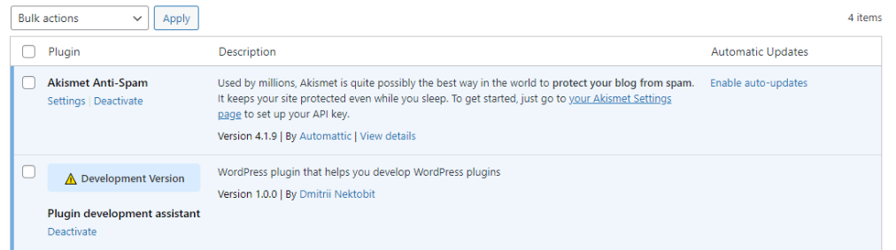

# plugin-development-assistant

WordPress plugin that helps you develop WordPress plugins

**Features:**

1. The plugin highlights any plugin or wp theme with a special tag that has `[development]` in its name. Example: `plugin-development-assistant[development]` folder will look like this in the admin area:

2. Disable "delete" link for `[development]` tagged plugin/theme name
